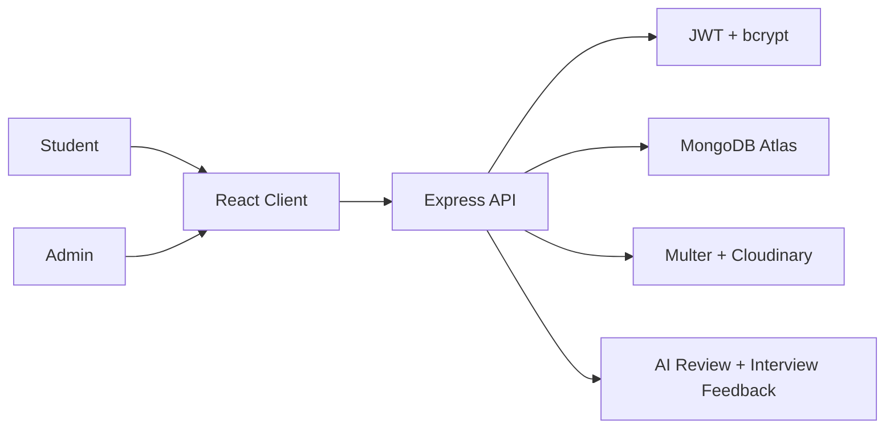

# CampusConnect AI

An AI-powered smart placement preparation portal for B.Tech students. It helps students track placement readiness, check company eligibility, manage resumes, track applications, practice DSA and aptitude, and prepare for interviews from one clean dashboard.

## Highlights

- React + Vite + Tailwind frontend
- Express.js backend with JWT-ready API structure
- Student dashboard with progress analytics
- Company eligibility checker
- Resume manager with AI review surface
- Job application tracker
- DSA progress tracker
- Aptitude quiz and leaderboard UI
- Company-wise interview preparation
- Admin overview for students, companies, and quiz stats
- Deployment-ready split for Vercel and Render

## Tech Stack

Frontend: React, Vite, Tailwind CSS, React Router, Axios, Chart.js, Lucide React

Backend: Node.js, Express.js, MongoDB/Mongoose-ready structure, JWT, bcrypt, Multer, Cloudinary-ready uploads

## Folder Structure

```text
campus-connect-/
├── client/
├── server/
├── docs/
├── README.md
├── package.json
└── .gitignore
```

## Run Locally

```bash
npm install
npm run dev
```

Client: `http://localhost:5173`

Server: `http://localhost:5001`

## Environment

Create `client/.env`:

```bash
VITE_API_URL=http://localhost:5001/api
```

Create `server/.env`:

```bash
PORT=5001
MONGO_URI=your_mongodb_atlas_uri
JWT_SECRET=replace_with_long_secret
CLIENT_URL=http://localhost:5173
CLOUDINARY_CLOUD_NAME=
CLOUDINARY_API_KEY=
CLOUDINARY_API_SECRET=
OPENAI_API_KEY=
```

## Architecture



## Deployment

- Deploy `client/` on Vercel.
- Deploy `server/` on Render.
- Set `VITE_API_URL` to your Render API URL.
- Add MongoDB Atlas and Cloudinary environment variables on Render.

## Future Enhancements

- Email placement notifications
- Calendar reminders
- Company discussion forum
- Mock interview scheduling
- Coding platform integrations
- AI career recommendations
